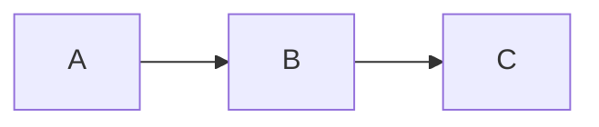

# mermaid-nvim

Render mermaid diagrams as ASCII art directly in your Neovim buffer.

Supports both standard fenced code blocks (` ```mermaid `) and container syntax (`:::mermaid`).

## Requirements

- Neovim >= 0.11
- A mermaid-to-ASCII CLI tool (default: [termaid](https://github.com/fasouto/termaid))

## Installation

### With lazy.nvim

```lua
{
  "searleser97/mermaid-nvim",
  ft = { "markdown" },
  build = "pip install termaid",
  opts = {},
}
```

To also install the interactive TUI viewer (optional, for `:MermaidFloat` in terminal mode):

```lua
{
  "searleser97/mermaid-nvim",
  ft = { "markdown" },
  build = "pip install termaid[tui]",
  opts = {},
}
```

## Configuration

```lua
require('mermaid-nvim').setup({
  -- Command to render mermaid (receives source via stdin)
  cmd = { 'termaid' },

  -- Render automatically on file open / text change
  enabled = true,

  -- Debounce time before re-rendering (ms)
  debounce_ms = 300,

  -- How to display render errors: 'virtual_text', 'notify', or 'silent'
  on_error = 'virtual_text',

  -- Set nowrap + virtualedit + smoothscroll on markdown windows
  -- Enables horizontal scrolling for wide diagrams
  nowrap = true,
})
```

## Usage

Mermaid blocks are automatically rendered as ASCII art when you open a markdown file.

### Commands

| Command | Description |
|---------|-------------|
| `:MermaidToggle` | Toggle the block under cursor between preview and source |
| `:MermaidToggleAll` | Toggle all blocks between preview and source |
| `:MermaidFloat` | Open the block under cursor in a scrollable floating window |
| `:MermaidRender` | Re-render all blocks in the current buffer |
| `:MermaidClear` | Clear all previews in the current buffer |

### Interaction

- **Enter** on a mermaid block opens it in a floating window
- **Click** on a mermaid block opens it in a floating window
- **`q`** or **`<Esc>`** closes the floating window

### Supported syntax

````markdown

````

```markdown
:::mermaid
graph LR
  A --> B --> C
:::
```

## Integration with render-markdown.nvim

If you use [render-markdown.nvim](https://github.com/MeanderingProgrammer/render-markdown.nvim),
disable its code block rendering for mermaid to avoid conflicts:

```lua
require('render-markdown').setup({
  code = {
    disable = { 'mermaid' },
  },
})
```

## Alternative renderers

You can use any tool that reads mermaid from stdin and outputs ASCII:

```lua
-- mmdflux (Rust, single binary)
cmd = { 'mmdflux' }

-- mermaid-ascii (Go)
cmd = { 'mermaid-ascii' }
```

## Health check

Run `:checkhealth mermaid-nvim` to verify your setup.
