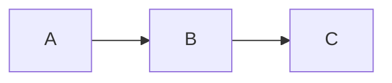

# mermaid-nvim

Render mermaid diagrams as ASCII art directly in your Neovim buffer.

Supports both standard fenced code blocks (` ```mermaid `) and container syntax (`:::mermaid`).

## Requirements

- Neovim >= 0.11
- A mermaid-to-ASCII CLI tool (default: [termaid](https://github.com/fasouto/termaid))

## Installation

### With lazy.nvim

```lua
{
  "searleser97/mermaid-nvim",
  ft = { "markdown" },
  build = "pip install termaid",
  opts = {},
}
```

To also install the interactive TUI viewer (optional, for `:MermaidFloat` in terminal mode):

```lua
{
  "searleser97/mermaid-nvim",
  ft = { "markdown" },
  build = "pip install termaid[tui]",
  opts = {},
}
```

## Configuration

```lua
require('mermaid-nvim').setup({
  -- Command to render mermaid (receives source via stdin)
  cmd = { 'termaid' },

  -- Render automatically on file open / text change
  enabled = true,

  -- Preview mode: 'tab' opens in a new tab, 'float' opens in a floating window
  preview_mode = 'tab',

  -- Buffer names to exclude (plain substring match)
  exclude_bufs = {},

  -- Debounce time before re-rendering (ms)
  inline_render_delay_ms = 300,

  -- How to display render errors: 'virtual_text', 'notify', or 'silent'
  on_error = 'virtual_text',
})
```

## Recommended window settings for markdown

The plugin does **not** force any window settings on your markdown buffers. If you want
horizontal scrolling and free cursor movement (useful for wide diagrams), add this to
your Neovim config:

```lua
vim.api.nvim_create_autocmd('FileType', {
  pattern = 'markdown',
  callback = function()
    vim.opt_local.wrap = false
    vim.opt_local.virtualedit = 'all'
    vim.opt_local.smoothscroll = true
  end,
})
```

## Usage

Mermaid blocks are automatically rendered as ASCII art when you open a markdown file.

### Commands

| Command | Description |
|---------|-------------|
| `:MermaidToggle` | Toggle the block under cursor between preview and source |
| `:MermaidToggleAll` | Toggle all blocks between preview and source |
| `:MermaidFloat` | Open the block under cursor in a scrollable preview (tab or float) |
| `:MermaidRender` | Re-render all blocks in the current buffer |
| `:MermaidClear` | Clear all previews in the current buffer |

### Interaction

- **Enter** on a mermaid block opens it in preview (tab or float depending on `preview_mode`)
- **Click** on a mermaid block opens it in preview
- **`q`** or **`<Esc>`** closes the preview

### Preview navigation keymaps

| Key | Action |
|-----|--------|
| `←` `→` `↑` `↓` | Pan the viewport |
| `H` | Jump to left edge |
| `L` | Jump to right edge |
| `0` | Reset horizontal scroll |
| `c` | Center viewport on diagram |
| `t` | Center horizontally, scroll to top |
| `q` / `Esc` | Close preview |

### Supported syntax

````markdown

````

```markdown
:::mermaid
graph LR
  A --> B --> C
:::
```

## Image rendering (experimental)

For pixel-based rendering using [mermaid-cli](https://github.com/mermaid-js/mermaid-cli):

```lua
require('mermaid-nvim').setup({
  cmd = { 'mmdc' },
})
```

This renders diagrams as PNG images displayed via the iTerm2 inline images protocol
(OSC 1337). Supported terminals: WezTerm, iTerm2, and others with inline image support.

> **Note:** Image rendering is experimental. The image may overflow the viewport for
> tall diagrams, and rendering takes ~5 seconds (mmdc launches headless Chromium).

## Integration with render-markdown.nvim

If you use [render-markdown.nvim](https://github.com/MeanderingProgrammer/render-markdown.nvim),
disable its code block rendering for mermaid to avoid conflicts:

```lua
require('render-markdown').setup({
  code = {
    disable = { 'mermaid' },
  },
})
```

## Alternative renderers

You can use any tool that reads mermaid from stdin and outputs ASCII:

```lua
-- mmdflux (Rust, single binary)
cmd = { 'mmdflux' }

-- mermaid-ascii (Go)
cmd = { 'mermaid-ascii' }
```

## Health check

Run `:checkhealth mermaid-nvim` to verify your setup.
